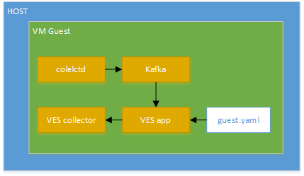
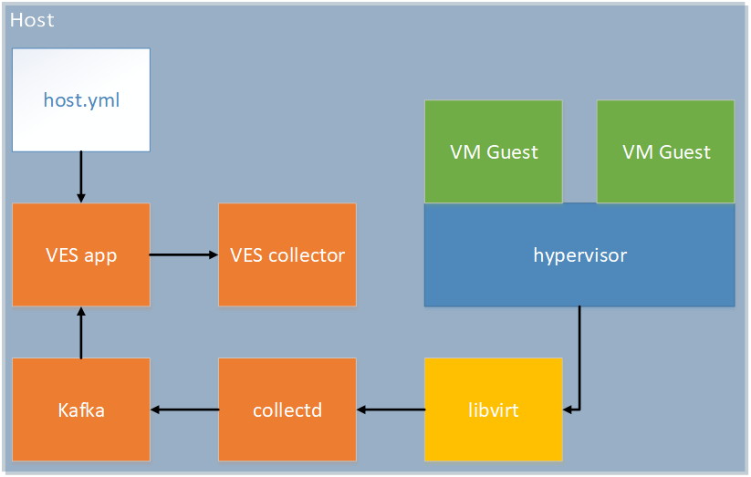
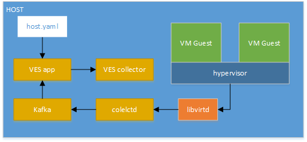
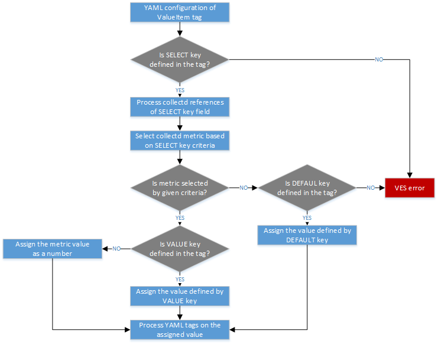
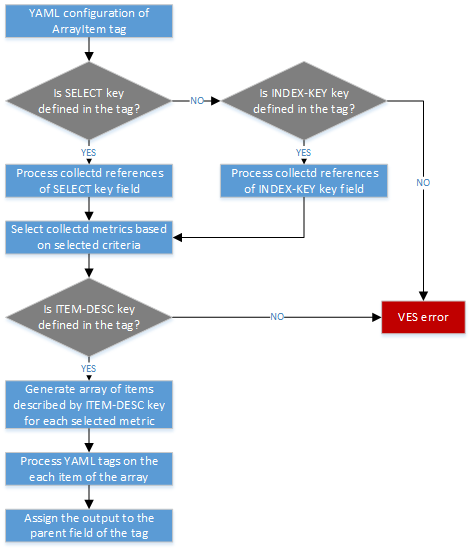
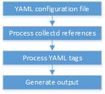

.. This work is licensed under a Creative Commons Attribution 4.0 International License.
.. http://creativecommons.org/licenses/by/4.0
.. (c) OPNFV, Intel Corporation and others.
.. _barometer-ves-userguide:

==========================
VES Application User Guide
==========================

The Barometer repository contains a python based application for VES (VNF Event
Stream) which receives the `collectd`_ specific metrics via `Kafka`_ bus,
normalizes the metric data into the VES message format and sends it into the VES
collector.

The application currently supports pushing platform relevant metrics through the
additional measurements field for VES.

Collectd has a ``write_kafka`` plugin that sends collectd metrics and values to
a Kafka Broker. The VES message formatting application, ves_app.py, receives metrics from
the Kafka broker, normalises the data to VES message format for forwarding to VES collector.
The VES message formatting application will be simply referred to as the "VES application"
within this userguide

The VES application can be run in host mode (baremetal), hypervisor mode (on a host with a hypervisor
and VMs running) or guest mode(within a VM). The main software blocks that are required to run the
VES application demo are:

        1. Kafka
        2. Collectd
        3. VES Application
        4. VES Collector

Install Kafka Broker
--------------------

1. Dependencies: install JAVA & Zookeeper.

   Ubuntu 16.04:

    .. code:: bash

        $ sudo apt-get install default-jre
        $ sudo apt-get install zookeeperd
        $ sudo apt-get install python-pip

   CentOS:

    .. code:: bash

        $ sudo yum update -y
        $ sudo yum install java-1.8.0-openjdk
        $ sudo yum install epel-release
        $ sudo yum install python-pip
        $ sudo yum install zookeeper
        $ sudo yum install telnet
        $ sudo yum install wget

    .. note:: You may need to add the repository that contains zookeeper.
      To do so, follow the step below and try to install `zookeeper` again
      using steps above. Otherwise, skip next step.

    .. code:: bash

        $ sudo yum install
        https://archive.cloudera.com/cdh5/one-click-install/redhat/7/x86_64/cloudera-cdh-5-0.x86_64.rpm

    Start zookeeper:

    .. code:: bash

        $ sudo zookeeper-server start

    if you get the error message like ``ZooKeeper data directory is missing at /var/lib/zookeeper``
    during the start of zookeeper, initialize zookeeper data directory using
    the command below and start zookeeper again, otherwise skip the next step.

    .. code:: bash

       $ sudo /usr/lib/zookeeper/bin/zkServer-initialize.sh
        No myid provided, be sure to specify it in /var/lib/zookeeper/myid if using non-standalone

2. Test if Zookeeper is running as a daemon.

    .. code:: bash

        $ telnet localhost 2181

    Type 'ruok' & hit enter.
    Expected response is 'imok' which means that Zookeeper is up running.

3. Install Kafka

    .. note:: VES doesn't work with version 0.9.4 of kafka-python. The
        recommended/tested version is 1.3.3.

    .. code:: bash

        $ sudo pip install kafka-python
        $ wget "https://archive.apache.org/dist/kafka/1.0.0/kafka_2.11-1.0.0.tgz"
        $ tar -xvzf kafka_2.11-1.0.0.tgz
        $ sed -i -- 's/#delete.topic.enable=true/delete.topic.enable=true/' kafka_2.11-1.0.0/config/server.properties
        $ sudo nohup kafka_2.11-1.0.0/bin/kafka-server-start.sh \
          kafka_2.11-1.0.0/config/server.properties > kafka_2.11-1.0.0/kafka.log 2>&1 &

    .. note:: If Kafka server fails to start, please check if the platform IP
        address is associated with the hostname in the static host lookup
        table. If it doesn't exist, use the following command to add it.

    .. code:: bash

        $ echo "$(ip route get 8.8.8.8 | awk '{print $NF; exit}') $HOSTNAME" | sudo tee -a /etc/hosts

4. Test the Kafka Installation

    To test if the installation worked correctly there are two scripts, producer and consumer scripts.
    These will allow you to see messages pushed to broker and receive from broker.

    Producer (Publish "Hello World"):

    .. code:: bash

        $ echo "Hello, World" | kafka_2.11-1.0.0/bin/kafka-console-producer.sh \
          --broker-list localhost:9092 --topic TopicTest > /dev/null

    Consumer (Receive "Hello World"):

    .. code:: bash

        $ kafka_2.11-1.0.0/bin/kafka-console-consumer.sh --zookeeper \
          localhost:2181 --topic TopicTest --from-beginning --max-messages 1 --timeout-ms 3000

Install collectd
----------------

Install development tools:

   Ubuntu 16.04:

    .. code:: bash

        $ sudo apt-get install build-essential bison autotools-dev autoconf
        $ sudo apt-get install pkg-config flex libtool

   CentOS:

    .. code:: bash

        $ sudo yum group install 'Development Tools'

.. The libkafka installed via the package manager may not work with collectd
   (due to compilation issue). Thus, it's recommented to use the library installed
   from sources using latest stable version of libkafka.

Install Apache Kafka C/C++ client library:

.. code:: bash

    $ git clone https://github.com/edenhill/librdkafka.git ~/librdkafka
    $ cd ~/librdkafka
    $ git checkout -b v0.9.5 v0.9.5
    $ ./configure --prefix=/usr
    $ make
    $ sudo make install

Build collectd with Kafka support:

.. code:: bash

    $ git clone https://github.com/collectd/collectd.git ~/collectd
    $ cd ~/collectd
    $ ./build.sh
    $ ./configure --with-librdkafka=/usr --without-perl-bindings --enable-perl=no
    $ make && sudo make install

.. note::

   If installing from git repository ``collectd.conf`` configuration file will be located in
   directory ``/opt/collectd/etc/``. If installing from via a package manager ``collectd.conf``
   configuration file will be located in directory ``/etc/collectd/``

Configure and start collectd. Modify Collectd configuration file ``collectd.conf``
as following:

- Within a VM: `Setup VES application (guest mode)`_
- On Host with VMs: `Setup VES application (hypervisor mode)`_
- No Virtualization: `Setup VES application (host mode)`_

Start collectd process as a service as described in :ref:`install-collectd-as-a-service`.

Setup VES application (guest mode)
----------------------------------

In this mode Collectd runs from within a VM and sends metrics to the VES collector.

    VES guest mode setup

Install dependencies:

.. code:: bash

    $ sudo pip install pyyaml python-kafka

Clone Barometer repo and start the VES application:

.. code:: bash

    $ git clone https://gerrit.opnfv.org/gerrit/barometer
    $ cd barometer/3rd_party/collectd-ves-app/ves_app
    $ nohup python ves_app.py --events-schema=guest.yaml --config=ves_app_config.conf > ves_app.stdout.log &

Modify Collectd configuration file ``collectd.conf`` as following:

.. include:: collectd-ves-guest.conf
      :code: bash

Start collectd process as a service as described in :ref:`install-collectd-as-a-service`.

.. note::

    The above configuration is used for a localhost. The VES application can be
    configured to use remote VES collector and remote Kafka server. To do
    so, the IP addresses/host names needs to be changed in ``collector.conf``
    and ``ves_app_config.conf`` files accordingly.

Setup VES application (hypervisor mode)
----------------------------------------

This mode is used to collect hypervisor statistics about guest VMs and to send
those metrics into the VES collector. Also, this mode collects host statistics
and send them as part of the guest VES message.

    VES hypervisor mode setup

Running the VES in hypervisor mode looks like steps described in
`Setup VES application (guest mode)`_ but with the following exceptions:

- The ``hypervisor.yaml`` configuration file should be used instead of ``guest.yaml``
  file when VES application is running.

- Collectd should be running on hypervisor machine only.

- Addition ``libvirtd`` dependencies needs to be installed on  where
  collectd daemon is running. To install those dependencies, see :ref:`virt-plugin`
  section of Barometer user guide.

- The next (minimum) configuration needs to be provided to collectd to be able
  to generate the VES message to VES collector.

.. note::
   At least one VM instance should be up and running by hypervisor on the host.

.. include:: collectd-ves-hypervisor.conf
      :code: bash

Start collectd process as a service as described in :ref:`install-collectd-as-a-service`.

.. note::

    The above configuration is used for a localhost. The VES application can be
    configured to use remote VES collector and remote Kafka server. To do
    so, the IP addresses/host names needs to be changed in ``collector.conf``
    and ``ves_app_config.conf`` files accordingly.

.. note:: The list of the plugins can be extented depends on your needs.

Setup VES application (host mode)
----------------------------------

This mode is used to collect platform wide metrics and to send those metrics into the VES collector.
It is most suitable for running within a baremetal platform.

Install dependencies:

.. code:: bash

    $ sudo pip install pyyaml

Clone Barometer repo and start the VES application:

.. code:: bash

    $ git clone https://gerrit.opnfv.org/gerrit/barometer
    $ cd barometer/3rd_party/collectd-ves-app/ves_app
    $ nohup python ves_app.py --events-schema=host.yaml --config=ves_app_config.conf > ves_app.stdout.log &

    VES Native mode setup

Modify collectd configuration file ``collectd.conf`` as following:

.. include:: collectd-ves-host.conf
                    :code: bash

Start collectd process as a service as described in :ref:`install-collectd-as-a-service`.

.. note::

    The above configuration is used for a localhost. The VES application can be
    configured to use remote VES collector and remote Kafka server. To do
    so, the IP addresses/host names needs to be changed in ``collector.conf``
    and ``ves_app_config.conf`` files accordingly.

.. note:: The list of the plugins can be extented depends on your needs.

Setup VES Test Collector
------------------------

.. note:: Test Collector setup is required only for VES application testing
   purposes.

Install dependencies:

.. code:: bash

    $ sudo pip install jsonschema

Clone VES Test Collector:

.. code:: bash

    $ git clone https://github.com/att/evel-test-collector.git ~/evel-test-collector

Modify VES Test Collector config file to point to existing log directory and
schema file:

.. code:: bash

    $ sed -i.back 's/^\(log_file[ ]*=[ ]*\).*/\1collector.log/' ~/evel-test-collector/config/collector.conf
    $ sed -i.back 's/^\(schema_file[ ]*=.*\)event_format_updated.json$/\1CommonEventFormat.json/' ~/evel-test-collector/config/collector.conf

Start VES Test Collector:

.. code:: bash

    $ cd ~/evel-test-collector/code/collector
    $ nohup python ./collector.py --config ../../config/collector.conf > collector.stdout.log &

VES application configuration description
-----------------------------------------

**Details of the Vendor Event Listener REST service**

REST resources are defined with respect to a ``ServerRoot``::

    ServerRoot = https://{Domain}:{Port}/{optionalRoutingPath}

REST resources are of the form::

    {ServerRoot}/eventListener/v{apiVersion}`
    {ServerRoot}/eventListener/v{apiVersion}/{topicName}`
    {ServerRoot}/eventListener/v{apiVersion}/eventBatch`

Within the VES directory (``3rd_party/collectd-ves-app/ves_app``) there is a
configuration file called ``ves_app_conf.conf``. The description of the
configuration options are described below:

**Domain** *"host"*
  VES domain name. It can be IP address or hostname of VES collector
  (default: ``127.0.0.1``)

**Port** *port*
  VES port (default: ``30000``)

**Path** *"path"*
  Used as the "optionalRoutingPath" element in the REST path (default: ``vendor_event_listener``)

**Topic** *"path"*
  Used as the "topicName" element in the REST  path (default: ``example_vnf``)

**UseHttps** *true|false*
  Allow application to use HTTPS instead of HTTP (default: ``false``)

**Username** *"username"*
  VES collector user name (default: empty)

**Password** *"passwd"*
  VES collector password (default: empty)

**SendEventInterval** *interval*
  This configuration option controls how often (sec) collectd data is sent to
  Vendor Event Listener (default: ``20``)

**ApiVersion** *version*
  Used as the "apiVersion" element in the REST path (default: ``3``)

**KafkaPort** *port*
  Kafka Port (Default ``9092``)

**KafkaBroker** *host*
  Kafka Broker domain name. It can be an IP address or hostname of local or remote server
  (default: ``localhost``)

VES YAML configuration format
-----------------------------

The format of the VES message is generated by the VES application based on the
YAML schema configuration file provided by user via ``--events-schema``
command-line option of the application.

.. note:: Use ``--help`` option of VES application to see the
    description of all available options

.. note:: The detailed installation guide of the VES application is described in
    the `VES Application User Guide`_.

The message defined by YAML schema should correspond to format defined in
`VES shema definition`_.

.. warning:: This section doesn't explain the YAML language itself, so the
    knowledge of the YAML language is required before continue reading it!

Since, the VES message output is a JSON format, it's recommended to understand
how YAML document is converted to JSON before starting to create a new YAML
definition for the VES. E.g.:

The following YAML document:

.. code:: yaml

    ---
    additionalMeasurements:
      plugin: somename
      instance: someinstance

will be converted to JSON like this:

.. code:: json

    {
      "additionalMeasurements": {
        "instance": "someinstance",
        "plugin": "somename"
      }
    }

.. note:: The `YAML syntax` section of `PyYAML documentation`_ can be used
    as a reference for this.

VES message types
-----------------

The VES agent can generate two type of messages which are sent to the VES
collector. Each message type must be specified in the YAML configuration file
using a specific YAML tag.

Measurements
  This type is used to send a message defined in YAML configuration to the VES
  collector with a specified interval (default is 20 sec and it's configurable
  via command line option of the application). This type can be specified in
  the configuration using ``!Measurements`` tag. For instance:

  .. code:: yaml

      ---
      # My comments
      My Host Measurements: !Measurements
        ... # message definition

Events
  This type is used to send a message defined in YAML configuration to the VES
  collector when collectd notification is received from Kafka bus (collectd
  ``write_kafka`` plugin). This type can be specified in the configuration
  using ``!Events`` tag. For instance:

  .. code:: yaml

      ---
      # My comments
      My Events: !Events
        ... # event definition

Collectd metrics in VES
-----------------------

The VES application caches collectd metrics received via Kafka bus. The data
is stored in a table format. It's important to know it before mapping collectd
metric values to message defined in YAML configuration file.

VES collectd metric cache example:

+-----------+-----------+--------------------+-----------+----------------+-------------------+--------+---------+----------+
|   host    |  plugin   |  plugin_instance   |  type     |  type_instace  |       time        | value  | ds_name | interval |
+===========+===========+====================+===========+================+===================+========+=========+==========+
| localhost | cpu       |                    | percent   | user           | 1509535512.30567  | 16     | value   | 10       |
+-----------+-----------+--------------------+-----------+----------------+-------------------+--------+---------+----------+
| localhost | memory    |                    | memory    | free           | 1509535573.448014 | 798456 | value   | 10       |
+-----------+-----------+--------------------+-----------+----------------+-------------------+--------+---------+----------+
| localhost | interface |                    | eth0      | if_packets     | 1509544183.956496 | 253    | rx      | 10       |
+-----------+-----------+--------------------+-----------+----------------+-------------------+--------+---------+----------+
| 7ec333e7  | virt      | Ubuntu-12.04.5-LTS | percent   | virt_cpu_total | 1509544402.378035 | 0.2    | value   | 10       |
+-----------+-----------+--------------------+-----------+----------------+-------------------+--------+---------+----------+
| 7ec333e7  | virt      | Ubuntu-12.04.5-LTS | memory    | rss            | 1509544638.55119  | 123405 | value   | 10       |
+-----------+-----------+--------------------+-----------+----------------+-------------------+--------+---------+----------+
| 7ec333e7  | virt      | Ubuntu-12.04.5-LTS | if_octets | vnet1          | 1509544646.27108  | 67     | tx      | 10       |
+-----------+-----------+--------------------+-----------+----------------+-------------------+--------+---------+----------+
| cc659a52  | virt      | Ubuntu-16.04       | percent   | virt_cpu_total | 1509544745.617207 | 0.3    | value   | 10       |
+-----------+-----------+--------------------+-----------+----------------+-------------------+--------+---------+----------+
| cc659a52  | virt      | Ubuntu-16.04       | memory    | rss            | 1509544754.329411 | 4567   | value   | 10       |
+-----------+-----------+--------------------+-----------+----------------+-------------------+--------+---------+----------+
| cc659a52  | virt      | Ubuntu-16.04       | if_octets | vnet0          | 1509544760.720381 | 0      | rx      | 10       |
+-----------+-----------+--------------------+-----------+----------------+-------------------+--------+---------+----------+

It's possible from YAML configuration file to refer to any field of any row of
the table via special YAML tags like ``ValueItem`` or ``ArrayItem``. See the
`Collectd metric reference`_ reference for more details.

.. note:: The `collectd data types file`_ contains map of ``type`` to
    ``ds_name`` field. It can be used to get possible value for ``ds_name``
    field. See the `collectd data types description`_ for more details on
    collectd data types.

Aging of collectd metric
~~~~~~~~~~~~~~~~~~~~~~~~

If the metric will not be updated by the collectd during the double metric
interval time, it will be removed (aged) from VES internal cache.

VES YAML references
-------------------

There are four type of references supported by the YAML format: System,
Config, Collectd metric and Collectd notification. The format of the reference
is the following:

.. code:: yaml

    "{<ref type>.<attribute name>}"

.. note:: Possible values for ``<ref type>`` and ``<attribute name>`` are
    described in farther sections.

System reference
~~~~~~~~~~~~~~~~

This reference is used to get system statistics like time, date etc. The system
reference (``<ref type>`` = ``system``) can be used in any place of the YAML
configuration file. This type of reference provides the following attributes:

``hostname``
  The name of the host where VES application is running.

``id``
  Unique ID during VES application runtime.

``time``
  Current time in seconds since the Epoch. For example ``1509641411.631951``.

``date``
  Current date in ISO 8601 format, ``YYYY-MM-DD``. For instance ``2017-11-02``.

For example:

.. code:: yaml

    Date: "{system.date}"

Config reference
~~~~~~~~~~~~~~~~

This reference is used to get VES configuration described in `VES application
configuration description`_ sectoin. The reference (``<ref type>`` = ``config``)
can be used in any place of the YAML configuration file. This type of reference
provides the following attributes:

``interval``
  Measurements dispatch interval. It referenses to ``SendEventInterval``
  configuration of the VES application.

For example:

.. code:: yaml

    Interval: "{config.interval}"

Collectd metric reference
~~~~~~~~~~~~~~~~~~~~~~~~~

This reference is used to get the attribute value of collectd metric from the
VES cache. The reference (``<ref type>`` = ``vl``) can be used ONLY inside
``Measurements``, ``ValueItem`` and ``ArrayItem`` tags. Using the reference
inside a helper tag is also allowed if the helper tag is located inside the
tag where the reference is allowed (e.g.: ``ArrayItem``). The
``<attribute name>`` name corresponds to the table field name described in
`Collectd metrics in VES`_ section. For example:

.. code:: yaml

    name: "{vl.type}-{vl.type_instance}"

Collectd notification reference
~~~~~~~~~~~~~~~~~~~~~~~~~~~~~~~

This reference is used to get the attribute value of received collectd
notification. The reference (``<ref type>`` = ``n``) can be used ONLY inside
``Events`` tag. Using the reference inside a helper tag is also allowed if
the helper tag is located inside the ``Events`` tag. This type of reference
provides the following attributes:

``host``
  The hostname of received collectd notification.

``plugin``
  The plugin name of received collectd notification.

``plugin_instance``
  The plugin instance of the received collectd notification.

``type``
  The type name of the received collectd notification.

``type_instance``
  The type instance of the received collectd notification.

``severity``
  The severity of the received collectd notification.

``message``
  The message of the received collectd notification.

.. note:: The exact value for each attribute depends on the collectd plugin
  which may generate the notification. Please refer to the
  `collectd plugin description`_ document to get more details on the specific
  collectd plugin.

YAML config example:

.. code:: yaml

    sourceId: "{n.plugin_instance}"

Collectd metric mapping YAML tags
---------------------------------

This section describes the YAML tags used to map collectd metric values in the
YAML configuration file.

Measurements tag
~~~~~~~~~~~~~~~~

This tag is a YAML map which is used to define the VES measurement message. It's
allowed to be used multiple times in the document (e.g.: you can define multiple
VES messages in one YAML document). This tag works in the same way as `ArrayItem
tag`_ does and all keys have the same description/rules.

ValueItem tag
~~~~~~~~~~~~~

This tag is used to select a collectd metric and get its attribute value using
`Collectd metric reference`_. The type of this tag is a YAML array of maps with
the possible keys described below.

``SELECT`` (required)
  Is a YAML map which describes the select metric criteria. Each key name of the
  map must correspond to the table field name described in `Collectd metrics in VES`_
  section.

``VALUE`` (optional)
  Describes the value to be assigned. If not provided, the default
  ``!Number "{vl.value}"`` expression is used.

``DEFAULT`` (optional)
  Describes the default value which will be assigned if no metric is selected
  by ``SELECT`` criteria.

ValueItem tag description example:

.. code:: yaml

    memoryFree: !ValueItem
      - SELECT:
          plugin: memory
          type: memory
          type_instance: rss
      - VALUE: !Bytes2Kibibytes "{vl.value}"
      - DEFAULT: 0

The tag process workflow is described on the figure below.

    YAML ValueItem tag process workflow

ArrayItem tag
~~~~~~~~~~~~~

This tag is used to select a list of collectd metrics and generate a YAML array
of YAML items described by ``ITEM-DESC`` key. If no collectd metrics are
selected by the given criteria, the empty array will be returned.

``SELECT`` (optional)
  Is a YAML map which describes the select metrics criteria. Each key name of
  the map must correspond to the table field name described in `Collectd
  metrics in VES`_ section. The value of the key may be regular expression. To
  enable regular expression in the value, the YAML string containing ``/`` char
  at the beginning and at the end should be used. For example:

  .. code:: yaml

      plugin: "/^(?!virt).*$/" # selected all metrics except ``virt`` plugin

  The VES application uses the python RE library to work with regular
  expression specified in the YAML configuration. Please refer to `python
  regular expression syntax`_ documentation for more details on a syntax
  used by the VES.

  Multiple ``SELECT`` keys are allowed by the tag. If nor ``SELECT`` or
  ``INDEX-KEY`` key is specified, the VES error is generated.

``INDEX-KEY`` (optional)
  Is a YAML array which describes the unique fields to be selected by the tag.
  Each element of array is a YAML string which should be one of the table field
  name described in `Collectd metrics in VES`_ section. Please note, if this
  key is used, only fields specified by the key can be used as a collectd
  reference in the ``ITEM-DESC`` key.

``ITEM-DESC`` (required)
  Is a YAML map which describes each element of the YAML array generated by
  the tag. Using ``ArrayItem`` tags and other `Helper YAML tags`_ are also
  allowed in the definition of the key.

In the example below, the ArrayItem tag is used to generate an array of
``ITEM-DESC`` items for each collectd metrics except ``virt`` plugin with
unique ``plugin``, ``plugin_instance`` attribute values.

.. code:: yaml

    Measurements: !ArrayItem
      - SELECT:
          plugin: "/^(?!virt).*$/"
      - INDEX-KEY:
          - plugin
          - plugin_instance
      - ITEM-DESC:
          name: !StripExtraDash "{vl.plugin}-{vl.plugin_instance}"

The tag process workflow is described on the figure below.

    YAML ArrayItem tag process workflow

Collectd event mapping YAML tags
--------------------------------

This section describes the YAML tags used to map the collectd notification to
the VES event message in the YAML configuration file.

Events tag
~~~~~~~~~~

This tag is a YAML map which is used to define the VES event message. It's
allowed to be used multiple times in the document (e.g.: you can map multiple
collectd notification into VES message in one YAML document). The possible
keys of the tag are described below.

``CONDITION`` (optional)
  Is a YAML map which describes the select metric criteria. Each key name of
  the map must correspond to the name of attribute provided by `Collectd
  notification reference`_. If no such key provided, any collectd notification
  will map the defined YAML message.

``ITEM-DESC`` (required)
  Is a YAML map which describes the message generated by this tag. Only `Helper
  YAML tags`_ are allowed in the definition of the key.

The example of the VES event message which will be generate by the VES
application when collectd notification of the ``virt`` plugin is triggered
is described below.

.. code:: yaml

    ---
    Virt Event: !Events
      - ITEM-DESC:
          event:
            commonEventHeader:
              domain: fault
              eventType: Notification
              sourceId: &event_sourceId "{n.plugin_instance}"
              sourceName: *event_sourceId
              lastEpochMicrosec: !Number "{n.time}"
              startEpochMicrosec: !Number "{n.time}"
            faultFields:
              alarmInterfaceA: !StripExtraDash "{n.plugin}-{n.plugin_instance}"
              alarmCondition: "{n.severity}"
              faultFieldsVersion: 1.1
      - CONDITION:
          plugin: virt

Helper YAML tags
----------------

This section describes the YAML tags used as utilities for formatting the output
message. The YAML configuration process workflow is described on the figure
below.

    YAML configuration process workflow

Convert string to number tag
~~~~~~~~~~~~~~~~~~~~~~~~~~~~

The ``!Number`` tag is used in YAML configuration file to convert string value into
the number type. For instance:

.. code:: yaml

    lastEpochMicrosec: !Number "3456"

The output of the tag will be the JSON number.

.. code:: json

    {
      lastEpochMicrosec: 3456
    }

Convert bytes to Kibibytes tag
~~~~~~~~~~~~~~~~~~~~~~~~~~~~~~

The ``!Bytes2Kibibytes`` tag is used in YAML configuration file to convert
bytes into kibibytes (1 kibibyte = 1024 bytes). For instance:

.. code:: yaml

    memoryConfigured: !Bytes2Kibibytes 4098
    memoryConfigured: !Bytes2Kibibytes "1024"

The output of the tag will be the JSON number.

.. code:: json

    {
      memoryConfigured: 4
      memoryConfigured: 1
    }

Convert one value to another tag
~~~~~~~~~~~~~~~~~~~~~~~~~~~~~~~~

The ``!MapValue`` tag is used in YAML configuration file to map one value
into another value defined in the configuration. For instance:

.. code:: yaml

    Severity: !MapValue
      VALUE: Failure
      TO:
        Failure: Critical
        Error: Warnign

The output of the tag will be the mapped value.

.. code:: json

    {
      Severity: Critical
    }

Strip extra dash tag
~~~~~~~~~~~~~~~~~~~~

The ``!StripExtraDash`` tag is used in YAML configuration file to strip extra
dashes in the string (dashes at the beginning, at the end and double dashes).
For example:

.. code:: yaml

    name: !StripExtraDash string-with--extra-dashes-

The output of the tag will be the JSON string with extra dashes removed.

.. code:: json

    {
      name: string-with-extra-dashes
    }

Limitations
-----------

#. Only one document can be defined in the same YAML configuration file.

#. The collectd notification is not supported by `Kafka collectd plugin`_. Due to
   this limitation, the collectd notifications cannot be received by the VES
   application and the defined YAML event will not be generated and sent to the
   VES collector. Please note, that VES YAML format already supports the events
   definition and the format is descibed in the document.

.. _collectd: http://collectd.org/
.. _Kafka: https://kafka.apache.org/
.. _`VES`: https://wiki.opnfv.org/display/fastpath/VES+plugin+updates
.. _`VES shema definition`: https://gerrit.onap.org/r/gitweb?p=demo.git;a=tree;f=vnfs/VES5.0/evel/evel-test-collector/docs/att_interface_definition;hb=refs/heads/master
.. _`PyYAML documentation`: https://pyyaml.org/wiki/PyYAMLDocumentation
.. _`collectd plugin description`: https://github.com/collectd/collectd/blob/master/src/collectd.conf.pod
.. _`collectd data types file`: https://github.com/collectd/collectd/blob/master/src/types.db
.. _`collectd data types description`: https://github.com/collectd/collectd/blob/master/src/types.db.pod
.. _`python regular expression syntax`: https://docs.python.org/2/library/re.html#regular-expression-syntax
.. _`Kafka collectd plugin`: https://collectd.org/wiki/index.php/Plugin:Write_Kafka
